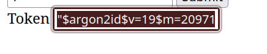
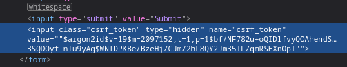

api for managing an online forum (WIP)

# TODO
- [x] handle DELETE requests 
- [ ] secure user authentication 
- [ ] Error handling
- [ ] make documentation and more descriptive readme for the api

# Installation

The only dependencies are rust and cargo.

After ensuring everything above is installed:

``` bash
git clone git@github.com:penky776/osf_hackathon_1.git
# OR
git clone https://github.com/penky776/osf_hackathon_1.git
```
To start the server, cd into the directory and:
``` bash
cargo run
```

# Usage

Log in with username and password using web client at http://localhost:3000/login

Copy session_token and username from cookie storage.

Copy the csrf_token from the interface or the hidden input element


## 1. Posts

### POST /addpost

```bash
curl --location 'http://localhost:3000/addpost' \
--header 'Cookie: session_token=SESSION_TOKEN; username=USERNAME' \
--data-urlencode 'csrf_token=CSRF_TOKEN' \
--data-urlencode 'title=POST_TITLE' \
--data-urlencode 'body=POST_BODY'
```

### POST /deletepost

```bash
curl --location 'http://localhost:3000/deletepost' \
--header 'Cookie: session_token=SESSION_TOKEN; username=USERNAME' \
--data-urlencode 'id=POST_ID' \
--data-urlencode 'csrf_token=CSRF_TOKEN'
```

## 2. Comments