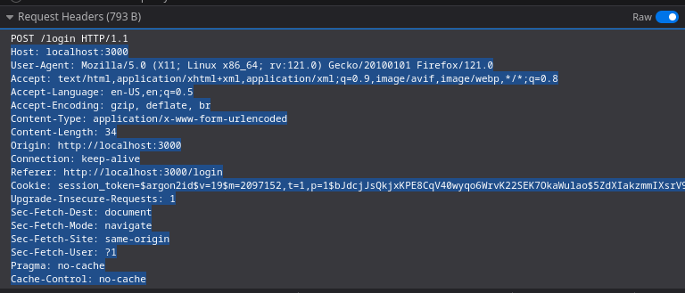
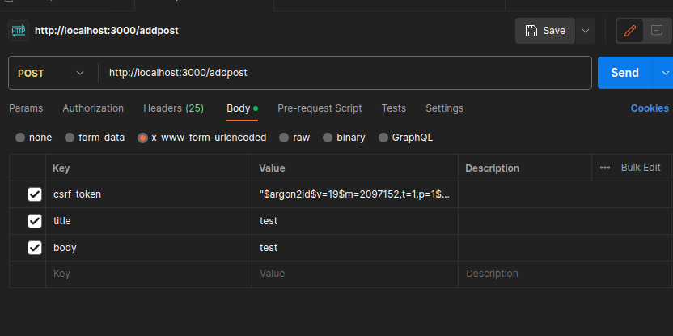

api for managing an online forum (WIP)

# TODO
- [x] handle DELETE requests 
- [ ] secure user authentication 
- [ ] Error handling
- [ ] make documentation and more descriptive readme for the api

# Usage

Log in with username and password using web client at http://localhost:3000/login

Copy the csrf_token from the interface or the hidden input element

Copy the request headers of the POST request that was used for login

Test routes with postman

## 1. Posts

### Add Post

url: http://localhost:3000/addpost

Method: POST 

Content-Type: x-www-form-urlencoded

Form Body in the order:

csrf_token: [CSRF-TOKEN] 
title: [POST TITLE] 
body: [POST BODY] 

### Delete Post